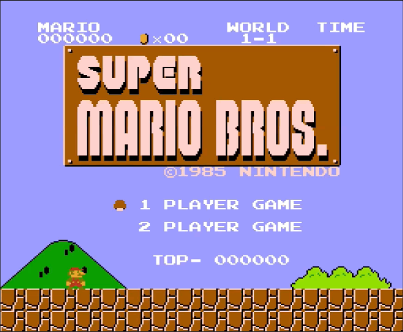
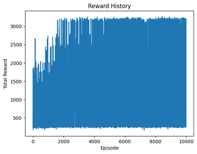
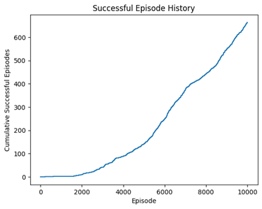
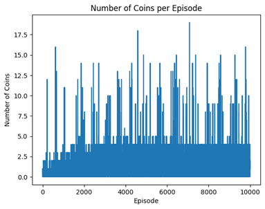
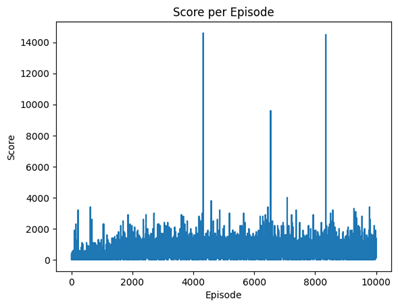

# SuperMarioBros.github.io


## Introduction
This project uses artificial intellegence techniques to create a Mario agent to play the original Super Mario Bros video game. The agent utilizes and was trained with a Convolutional Neural Network (CNN) to analyse raw pixel data, and Deep Q-Learning, a reinforcement learning algorithm. These algorithms select the best actions for the Mario agent to take within its state environment.

The following video is the teaser trailer for our project:
[](https://youtu.be/wialu6EQY00 "Video Title")

The following video is the final presentation for our project:


## Goals
The goal of this project was to use the AI techniques to manipulate the Mario agent to do the following:
- Speedrun the first level in the game from start to finish
- While speedrunning the level, collect as many coins and powerups as possible, and increase score

We felt as if these goals would simulate the power that AI modules have, while also emulating a basic real player run within the level. Originally we had a fairly equal bias between the two goals. Although, overtime we gravitated to biasing the speedrunning component of the project.

## Environment
We use a Super Mario Bros OpenAI gym environment (https://pypi.org/project/gym-super-mario-bros/). We utilized the prebuilt "COMPLEX_MOVEMENT" action space which illustrates the various actions that Mario can undergo within the observation space shown below.

### Action Space
- 0: No Movement
- 1: Move Right
- 2: Move Right + Jump
- 3: Move Right + Speed Up
- 4: Move Right + Jump + Speed Up
- 5: Jump
- 6: Move Left
- 7: Move Left + Jump
- 8: Move Left + Speed Up
- 9: Move Left + Jump + Speed Up
- 10: Down
- 11: Up

### Observation Space
The info dictionary returned by step contains the following:

| Key | Unit | Description |
| --- | ---- | ----------- |
| coins | int | Number of collected coins |
| flag_get | bool | True if Mario reached a flag |
| life | int | Number of lives left |
| score | int | Cumulative in-game score |
| stage | int | Current stage |
| status | str | Mario's status/power |
| time | int | Time left on the clock |
| world | int | Current world |
| x_pos | int | Mario's x position in the stage |
| y_pos | int | Mario's y position in the stage |

### Rewards
We used the above observation space to create a custom reward space to dictate Mario's learning patterns.

| Feature | Description | Value when Positive | Value when Negative | Value when Equal |
|---------|-------------|---------------------|---------------------|------------------|
| Difference in agent x values between states | Controls agent's movement | Moving right | Moving left | Not moving |
| Time difference in the game clock between frames | Prevents agent from staying still | - | Clock ticks | Clock doesn't tick |
| Death Penalty | Discourages agent from death | - | Agent dead | Agent alive |
| Coins | Encourages agent to get coins | Coin collected | - | No coin collected |
| Powerups | Encourages agent to get powerups and not lose them | Powerup collected | Powerup lost | Same status |
| Score | Encourages agent to get higher score | Score Increased | - | Score Stationary |
| Flag | Encourages agent to reach middle & end flag | Flag collected | - | Flag not collected |

## Results
The following graphs are the performance metrics describing our best performing training instance.







The following video shows our best trained agent completing as much of the first Super Mario Bros level as possible. Notice that the Mario agent detects enemies, floating blocks, tall pipes, and gaps, and successfully takes actions to defeat them, pass them, etc.


## Installation
**To clone this repository**
```bash
git clone https://github.com/BlakeMuchmore01/SuperMarioBros.github.io.git
```

**Next, create a virtual environment**
The command below is to create a conda environment. I'm using Python 3.10.13.

```bash
conda create --name smbrl python=3.10.13
```

To activate the environment.

```bash
conda activate smbrl
```

**Installing Super Mario Bros Environment**
The command below is to install the super mario bros gym environment
```bash
pip install gym-super-mario-bros
```

**Installing PyTorch v2.1.1**
The command below is to install pytorch
```bash
pip install torch
```

**Finally, install the rest of the requirements**
```bash
pip install -r requirements.txt
```

## Code Base
[Our Source Code](src/)
The source code for the project

[Required Packages](requirements.txt)
The required python packages for the project

[Related Documents](documents/)
Related documents (videos, report, etc)

## Conclusions and Future Works
Utilizing CNN and DQN for an AI agent proposed some difficulties. Although the goal of speedrunning the first level wasn't entirely achieved, we believe the algorithms and results show adequate success in training the agent to understand images within the environment, and adapt to them to get as far into the level as possible. 

Future work would be to explore methods to refine our code to fully complete the first level from start to finish. This could include things such as changing hyperparameters, training for longer/more efficiently, changing to a simpler action space, or changing some of the implementations of our methods. This was our first time using CNN and DQN and as such, further research will be required to find solutions for the mentioned refinement methods.

## Team Involved
Team No. 10

Team Members:
- Blake Muchmore 13898198
- Dominic Manno 13898186
- Mattew Georgievski 13894023
- Ryan Kim 13518598